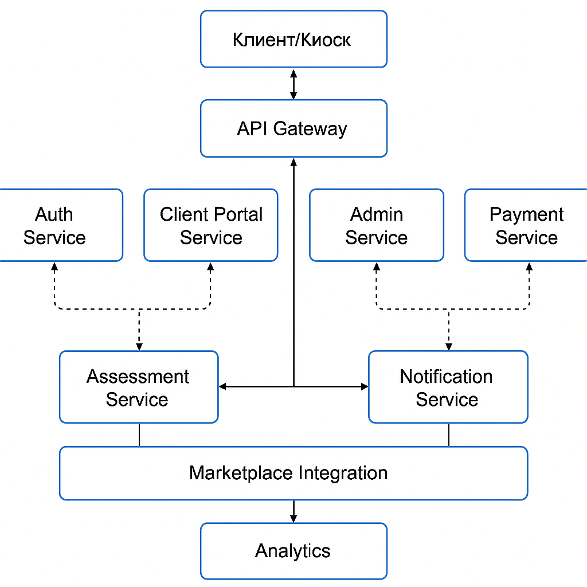

## Домашка 2: Интеграции

1. Взять ФТ и НФТ из HW_1
2. Подумать какие сервисы будут и какие интеграции между ними лучше сделать
3. Выбрать способ взаимодействия между сервисами, написать обоснование
4. Сделать верхнеуровневую схему HLD: описать клиента, сервисы, интеграции

## Пример
*Бронь отелей (Аналог букинга)*

1. Сервис авторизации и аутентификации
2. Сервис управления отелями (OMS)
3. Сервис бронирования
4. Сервис поиска и рекомендаций
5. Сервис отзывов
6. Сервис уведомлений
7. Сервис для интеграции с Aviasales

### Интеграции
1. Сервис авторизации и остальные: синхронная, для авторизации запросов
2. Сервис бронирования и сервис управления отелями: синхронная, на сервисе управления разместим информацию о наличии свободных комнат
3. Фронтенд и сервис уведомлений: асинхронная, можно сделать через вебсокеты

## Решение
*Going Green (переработка электроники)*

1. Auth Service - авторизация и аутентификация (OAuth 2.0 + 2FA, ФЗ-152)
2. Client Portal Service - личный кабинет клиента, создание и трекинг заявок
3. Assessment Service - автоматическая + ручная оценка техники (по правилам из Admin Service)
4. Admin Service - управление типами техники, правилами оценки, аналитикой
5. Logistics Service - генерация ярлыков, трекинг доставки, интеграция с Почтой России/СДЭК
6. Payment Service - проверка реквизитов, выплаты, интеграция с Т-Банк/Сбер, соблюдение ФЗ-115
7. Notification Service - уведомления (email, SMS, пуши) клиентам и операторам
8. Marketplace Integration Service - публикация одобренных товаров на yandex-market или аналогах
9. Analytics & Monitoring Service - сбор логов, метрик, ретрай событий, мониторинг отказов

### Интеграции
| Сервис                               | Интеграция                                  | Тип                                            |
| ------------------------------------ | ------------------------------------------- | ---------------------------------------------- |
| Auth Service                         | Все сервисы                                 | Синхронное, через API Gateway                  | 
| Client Portal ↔ Assessment           | Синхронное                                  | Клиент ждёт оценку здесь и сейчас              |
| Client Portal ↔ Logistics            | Синхронное                                  | Нужна мгновенная генерация ярлыка              | 
| Client Portal ↔ Notification         | Асинхронное, через брокер сообщений         | Уведомления об обновлениях заявок              |
| Client Portal ↔ Payment              | Синхронное                                  | Проверка реквизитов и статуса выплат           |
| Admin ↔ Assessment                   | Синхронное                                  | Мгновенное обновление правил оценки            |
| Marketplace Integration ↔ Assessment | Асинхронное                                 | Публикация лотов может выполняться с задержкой |
| Analytics ↔ Все сервисы              | Асинхронное, через брокер сообщений         | Потоковая обработка логов, событий             |

### Обоснование
- Использование синхронного взаимодействия — если результат нужен мгновенно (оценка, оплата, генерация ярлыков)
- Использование асинхронного взаимодействия — если операции долгие или должны быть надёжными (уведомления, публикация на маркетплейс, аналитика)
- Использование брокера сообщений — для отказоустойчивой доставки событий, ретраев
- Использование API Gateway — единая точка входа, шифрование трафика, rate-limiting, логирование

### Верхнеуровневая схема HLD

