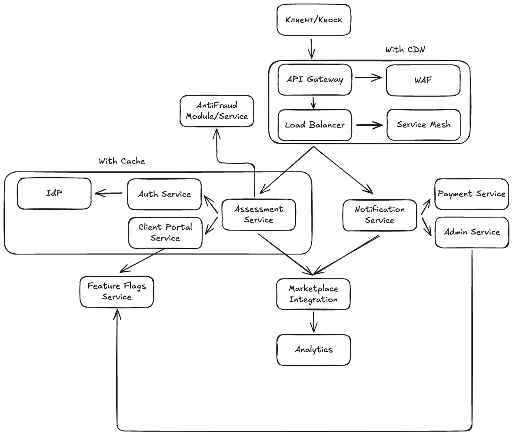

### Задание
Доделать High Level Design, добавив в систему дополнительные компоненты и обосновать их целесообразность.

Ваша задача понять, какие дополнительные компоненты ОБЯЗАТЕЛЬНЫ (MUST) в вашей системе, а какие МОЖНО (SHOULD) добавить в систему.

Если знаете, какие конкретно компоненты выбрать (технологии): пишите в реализацию. Если нет, не страшно.

Добавить их на схему в ваш HLD.

### Пример

### **1. Обязательные компоненты (MUST)**

| Компонент         | Обоснование                                                                 | Реализация (опционально)                     |
|-------------------|-----------------------------------------------------------------------------|--------------------------------------------|
| **Load Balancer** | Распределение трафика между инстансами сервисов. Без него горизонтальное масштабирование невозможно | Yandex Load Balancer |
| **CDN**           | Доставка статики с edge-узлов. Снижает latency для глобальных пользователей | Cloudflare + S3-бакет      |
| **Кэш**   | Уменьшение нагрузки на БД для "горячих" данных | Redis Cluster для кеша маршрутов и сессий  |
| **IdP**           | Централизованная аутентификация для всех ролей (OAuth 2.0) | Keycloak|
| **WAF**           | Защита от OWASP Top 10 | Cloudflare WAF с кастомными правилами      |
| **CI/CD**         | Автоматизация развертывания. Без нее уменьшится T2M и увеличится риск человеческого фактора на ПРОД | GitLab CI: build → security scan → canary deploy |
| **Обзервабилити** | Логирование таких-то сервисов, снятие таких-то метрик, трекаем такие-то трейсы | Opentelemery Collector + Prometheus + Loki + Tempo + Grafana      |
| **Резервное копирование** | Гарантия восстановления данных (RPO < 1 мин). Требование 152-ФЗ. | Daily snapshots S3 + WAL-G для PostgreSQL |

---

### **2. Рекомендуемые компоненты (SHOULD)**

| Компонент          | Обоснование                                                                 | Реализация (опционально)                    |
|--------------------|-----------------------------------------------------------------------------|--------------------------------------------|
| **Service Mesh**   | Упрощение управления трафиком между микросервисами. Полезно при >5 сервисах | Istio для retries/timeouts/circuit breaking |
| **Geo DNS**     | Маршрутизация пользователей к ближайшему кластеру | GeoDNS (Yandex DNS → Москва/СПБ кластеры)  |
| **Feature Flags**  | Безопасный rollout фич                 | LaunchDarkly для управления в runtime       |
| **API Gateway** | Rate limiting, преобразование протоколов, AntiDDoS| Tyk API MGMT |

### Решение

### **1. Обязательные компоненты (MUST)**

| Компонент                 | Обоснование                                                                                                                  | Реализация (опционально)                         |
| ------------------------- | ---------------------------------------------------------------------------------------------------------------------------- | ------------------------------------------------ |
| **Load Balancer**         | Без балансировки между инстансами сервисов невозможно горизонтальное масштабирование, особенно под пиковые 500 RPS.          | Yandex Load Balancer / nginx + keepalived        |
| **CDN**                   | Доставка статики (фото устройств, интерфейс фронта). Особенно важно при фотооценке. Уменьшает latency и нагрузку на backend. | Cloudflare CDN + Object Storage (S3-совместимое) |
| **Кэш**                   | Ускорение доступа к сессиям, предварительной оценке, часто запрашиваемым конфигурациям и справочникам.                       | Redis Cluster                                    |
| **IdP**                   | Централизованная аутентификация клиентов, операторов, админов. Обеспечивает SSO, OAuth 2.0, 2FA.                             | Keycloak / Auth0                                 |
| **WAF**                   | Защита от OWASP Top 10: SQLi, XSS, SSRF. Особенно важна из-за взаимодействия с внешними API (банки, логистика).              | Cloudflare WAF / ModSecurity                     |
| **CI/CD**                 | Безопасный и быстрый деплой. Позволяет без боли выкатить исправления в прод, проводить canary-релизы.                        | GitLab CI/CD + Docker + Helm + ArgoCD            |
| **Обзервабилити**         | Логирование и метрики для всех микросервисов, трейсинг запросов (например, от создания заявки до выплаты).                   | Prometheus + Grafana + Loki + Tempo              |
| **Резервное копирование** | 152-ФЗ требует гарантии восстановления. Базы и файлы с оценками, фото и личными данными клиентов должны быть защищены.       | WAL-G для PostgreSQL + ежедневные S3 snapshots   |

### **2. Рекомендуемые компоненты (SHOULD)**

| Компонент                  | Обоснование                                                                                          | Реализация (опционально)                         |
| -------------------------- | ---------------------------------------------------------------------------------------------------- | ------------------------------------------------ |
| **Service Mesh**           | Более 9 микросервисов. Нужно управлять retries, timeouts, circuit breaking, mTLS внутри mesh’а.      | Istio + Envoy                                    |
| **Geo DNS**                | Будет полезно при масштабировании на всю РФ (например, отправка в СДЭК из разных регионов).          | Yandex.Cloud DNS + маршрут по географии          |
| **Feature Flags**          | Безопасный rollout фич (например, новые типы техники, оценочные модели).                             | Unleash / LaunchDarkly / homemade toggle-service |
| **API Gateway**            | Централизованная точка входа, rate limiting, логгирование, преобразование REST↔gRPC.                 | Tyk / Kong / Yandex API Gateway                  |
| **Anti-Fraud Service/Module**      | Предотвращение злоупотреблений системой (мультиаккаунты, попытки обмана при оценке).                 | ML-плагин или эвристики, интеграция с antifraud  |
| **Data Quality Validator** | Проверка корректности фото/данных техники до отправки (например, загружено фото не того устройства). | ML/AI-интеграция, предварительный image-checker  |
| **Security Scanner**       | Автоматический скан кода и образов на уязвимости до выката на прод.                                  | Snyk + Trivy + GitLab Security Stage             |

### Верхнеуровневая схема HLD v2

